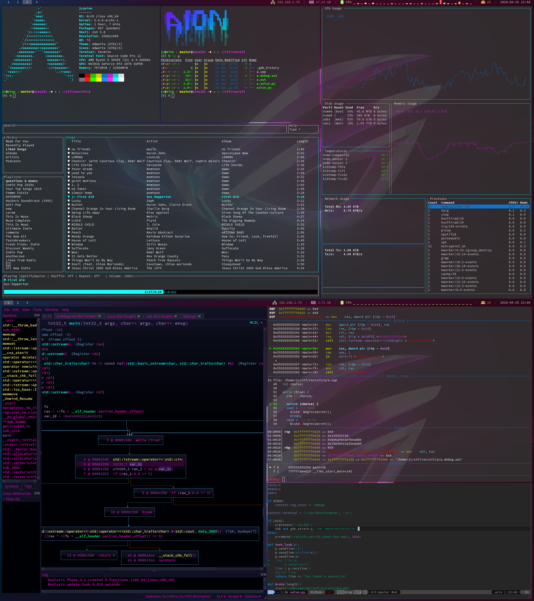

# Here are my dotfiles

I run arch linux with the i3-gap window manager, and polybar instead of i3status. The result is this:

I also run a whole lot of my desktop gui apps in docker containers, so check out my [dockerfiles](https://gitlab.com/juanpunchman/dockerfiles) too.

# dependencies
- [oh-my-zsh](https://github.com/robbyrussell/oh-my-zsh)
- [spacemacs](http://spacemacs.org/)
- [picom](https://github.com/yshui/picom)
- [i3-gaps](https://github.com/Airblader/i3) 
- [polybar](https://github.com/jaagr/polybar) 
- [xorg](https://www.x.org/wiki/)
- [ytop](https://github.com/cjbassi/ytop)
- [exa](https://github.com/ogham/exa)
- [Spotify Tui](https://github.com/Rigellute/spotify-tu)
- [pwndbg](https://github.com/pwndbg/pwndbg)
- [docker](https://docs.docker.com/get-docker/)
